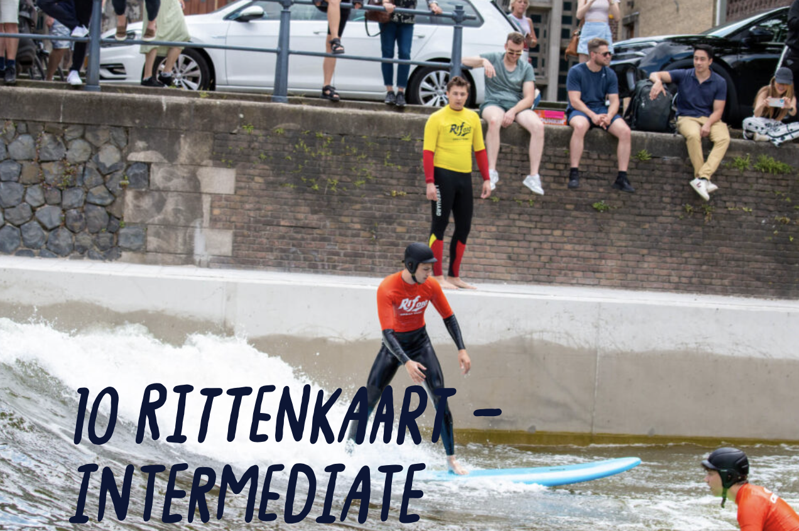

# Riding Shallow Waters 

<div>
 
</div>


## with Domenico Lahaye and Henk Schuttelaars 

## To Elaborate Further 
  
### Beginners Level 

1. bifurcation analysis using HarmonicBalance.jl: include quadratic damping (what to expect?)
1. bifurcation analysis: Duffing equation as example of bifurcationkit.jl, dynamicalsystem.jl or alternative (search Discourse forum)
1. (later): transient analysis: two-mass system: coupled position - velocity formulation: [IMEX solver](https://docs.sciml.ai/DiffEqDocs/stable/solvers/split_ode_solve/#Implicit-Explicit-(IMEX)-ODE): linear solver setup prior to time-stepping loop; 
1. (later): harmonic analysis: preconditioned Krylov subspace solver for the Jacobian at each Newton step; structure of the Jacobian; large number of small blocks vs. small number of large blocks; block ILU after reordering of the coefficient matrix; what Krylov package to use? 

### Intermediate Level 

1. bifurcation analysis: bifurcationkit.jl on the scalar wave equation after transformation to the harmonic balance mthod  
1. (later): transient analysis: IMEX 
1. (later): harmonic analysis: preconditioned Krylov method within the Newton iteration; 

### Expert Level 

1. problem formululation and reference solution: more documentation on channel test case from students of 2023 and thesis of Tjebbe Hepkema 
1. FourierFlows.jl for generating reference solutions 
1. Lorentz aproximation of the friction of the river bed. See e.g. Eqn. (4) in [Lorentz linearisation](https://lorentz.leidenuniv.nl/history/zuiderzee/Lorentz_linearisation.pdf). Friction becomes linear. If also the advection term is linearized and if also th mass conservation equation is linearized, the entire problem becoms linear. Harmonic balance method becomes an exact solution method. 
1. In a particular treatment, the non-linearity can be written as polynomial. The root finding homotype method can again be used with the amplitude of the friction as parameter to be varried;     
1. pitch fork bifurcation in treatment of amplitude of the friction term. Perturbation in water elevation remains zero for friction below a threshold value;   
1. spatial discretization: staggered grid in 1D and 2D space;
1. bifurcation analysis: bifurcationkit.jl
1. (later): transient analysis: IMEX 
1. (later): harmonic analysis: preconditioned Krylov method within the Newton iteration; 

## Section 1: Introduction 

This project aims at contributing to the computational modeling of [tidal flows](https://en.wikipedia.org/wiki/Tide#Current) and [sediment transport](https://en.wikipedia.org/wiki/Sediment_transport) in rivers. The flow of water in rivers can be described by the [shallow water equations](https://en.wikipedia.org/wiki/Shallow_water_equations) (linear vs. non-linear variant, laminar vs. turbulent model). When exicited periodically (e.g. by tidal motion at the inlet of the channel), the non-linear nature of the equations will deform (modulate) the amplitude and frequency of the driving system. After sufficiently long time, the signal will become periodic again. Both time-integration (after spatial discretization or method of lines) and harmonic balance methods (either after spatial or temporal discretization) will be explored. See the Section entitled Analysis in [wikipedia page on tidal flows](https://en.wikipedia.org/wiki/Tide#Current) for a motivation of harmonic balance method in the context of this project. 

The <b>goals</b> of the project include 
1. to solve the shallow water equations using a blend of analytical and numerical methods;   
2. to compute the amplitude and temporal frequency content of the computed axial and transversal velocity components and the water height;
3. to discover patterns in the sediment formation and study the stability of these patterns (via bifurcation analysis).

The <b>use of the Julia programming language</b> is an integral part of the learning objectives of this project. Non-linear terms play an essential role in modifying the temporal frequency content of waves as they propagate. The analysis of these non-linear terms requires the computation of the Jacobian, independent of whether a transient time-stepping or harmonic balance method is used. Functions to compute these Jacobians in Python do exist. These functions, however, are either computationally costly (in case that finite difference quotients are used) or non-trivial to use (in case that automatic differentiation in a library like e.g. [JAX](https://jax.readthedocs.io/en/latest/quickstart.html) is used). Switching to Julia alleviates these bottlenecks. 
 
## Section 2: Project Levels 

The project is divided in various levels that are outlined below.

### Beginner Level: Mass-Spring-Damper Systems 

Here we lump the body of water to a single point-mass or a system of multiple point massess. We assume this body to be subject to periodic forcing (alternating low and high tide) and friction (due to e.g. contact with river bed). The effect of non-linear springs and non-linear dampers on the motion of the mass subject to periodic forcing will be explored. The goal of this level to introduce key concepts, analysis tools and software techniques in the project.

The primary notebook for this level is [notebook on mass-spring-damper systems](./mass-spring-damper-systems.ipynb)

Supporting notebooks for this level include
1. notebook on [the harmonic balance method](./harmonic_balance_method.ipynb);
2. notebook on [Time-Integration using DifferentialEquations.jl](https://github.com/ziolai/software/blob/master/intro_ode.ipynb)
3. notebook on [analytical and symbolic computations](./analytical_symbolic_computations.ipynb);  

The <b>goals</b> of beginners level of the assignments are to: 
1. solve for periodic solutions (equilibrium between forcing, damping and non-linear stiffness) of the Duffing equation using <b>time-integration</b>. Investigate aspects such as computational cost (CPU-time and memory requirements) vs. accuracy (time step size, absolute tolerance, relative tolerance), implicit vs. explicit time integration methods, low vs. high order time integration methods, second order vs. coupled first order formulation, operator splitting allowing to treat linear stiffness implicitly and non-linar stiffness explicitly, automatic differentiation to compute the Jacobian and GPU acceleration;
2. solve for periodic solution using the <b>harmonic balance method</b>. As above. Include number of harmonics in the harmonic balance soliution;' 
3. investigate how periodic solutions change with <b>changing parameters</b> (stiffness, damping, amplitude and frequency of the excitation) using bifurcation analysis; 

In case successful, possibly extend to multiple interconnected point masses. 

### Intermediate Level: Non-Linear Scalar Wave Equation 

Here we describe water wave as transversal or longitudinal wave propagation in spring or membrane excited by periodic forcing. The physics of the change of water height is neglected. The effect of the non-linearity on the temporal frequency content of the solution will again be explored. 

The primary notebook for this level is [notebook on 1D scalar wave equations](./scalar-wave-equation.ipynb). Extension to 2D is available in [internship previous student](https://github.com/AnouchkaDESMETTRE/TU_Delft_Internship). (Requires extension to include the harmonic balance method). 

#### One-Dimensional Space-Time Linear Wave Equation with Periodic Forcing

1. problem formulation: PDE plus periodic boundary conditions and initial conditions for position and velocity. Possibly incluce a linear transport term (using first order upwinding); 
2. analytical reference solution, at least for the linear case; 
3. spatial discretization using second-order central finite difference scheme on a uniform mesh; 
4. time discretization in both second order and coupled first order;
5. harmonic balance method (linear problem formulation, problem set-up and problem solve for single and multiple frequencies); 
6. bifurcation analysis for periodic-in-time solution and analysis for changing parameters; 

#### One-Dimensional Space-Time Non-Linear Wave Equation with Periodic Forcing

1. Extend above with non-linear damping and transport term;  

#### Two-Dimensional Space-Time (Non-)Linear Wave Equation with Periodic Forcing

1. Extend above from 1D space (only $x$) to 2D space (both $x$ and $y$) by tensor product;  

Supporting notebooks
1. seperation of variables to solve linear wave equation analytically taking various boundary conditions into account; 
2. method of lines to linear wave equation numerically by first discretizing in space and subsequently use time integration; 


### Expert Level: Tidal Flow in Rivers and the Shallow Water Equations 

Shallow water equations describe the propagation of water waves in rivers. Both linear and non-linear variants of the model. They are derived from the Navier-Stokes equations by averaging in the depth direction. 

The primary notebook for this level is [notebook on shallow water equations](./shallow-water-equations.ipynb) (requires implementation of linear SWE (operators constant throught time integration) and non-linear SWE (operators updated at each time step)). 

#### One-Dimensional Space-Time Non-Rotational (Non-)Linear Shallow Water Equations with Periodic Forcing

1. problem formulation: system of 2 coupled PDEs for velocity in $x$-direction $u(x,t)$ and water height $\xi(x,t)$;
2. reference solution by running a third party code; 

$$
\frac{\partial \xi}{\partial t} = -H \, = \text{div}(u) = -  H \, \frac{\partial u}{\partial x}  
$$

$$
\frac{\partial u}{\partial t} = -g \, [ \text{grad}(\xi) ]_x + f(x,t) = - g \, \frac{\partial \xi}{\partial x} + f(x,t)
$$

A point of departure for this work is the [notebook on scalar transport equations](./advection-equation.ipynb)

#### One-Dimensional Space-Time Rotational (Non-)Linear Shallow Water Equations with Periodic Forcing

1. problem formulation: system of 3 coupled PDEs for velocity in $x$-direction $u(x,t)$, velocity in $y$-direction $v(x,t)$  and water height $\xi(x,t)$;
2. reference solution by running a third party code; 

#### Two-Dimensional Space-Time Linear Shallow Water Equations with Periodic Forcing

<b>Problem Formulation</b> 

$$
\frac{\partial \xi}{\partial t} + H \, ( \nabla  \cdot {\mathbf u} )  = 0 
$$

$$
\frac{\partial {\bf u}}{\partial t} + g \, \nabla \xi + f \, {\bf u}^{\perp} + {\bf F}_p = {\bf 0}  
$$ 

or more explicitly in terms of components (dropping Coreolis terms)  

$$
\frac{\partial \xi}{\partial t} + H \, ( \frac{\partial u}{\partial x} + \frac{\partial v}{\partial y} )  = 0  
$$

$$
\frac{\partial {u}}{\partial t} = - g \, \frac{\partial \xi}{\partial x} + {\bf F}_{p,x}   
$$ 

$$
\frac{\partial {v}}{\partial t} = - g \, \frac{\partial \xi}{\partial y} + {\bf F}_{p,y}  
$$ 

Impose periodic boundary conditions for $\xi(x,y,t)$, $u(x,y,t)$ and $v(x,y,t)$. Impose initial conditions for $\xi(x,y,t)$, $u(x,y,t)$ and $v(x,y,t)$. 

<b>Reference Solution</b> Provide here a reference solution from literature. See, e.g., [Chapter 4 book of Geof Vallis](https://empslocal.ex.ac.uk/people/staff/gv219/ecmm719/ess-ecmm719.pdf). 

<b>Spatial Discritization</b> For the spatial discritization, we consider a uniform mesh with $N_x+1$ grid points in $x$-direction and $N_y+1$ grid points in $y$-direction. The total number of grid points is thus equal to $N = (N_x+1)(N_y+1)$. We assume a staggered layout of the unknowns $u(x,y,t)$, $v(x,y,t)$ and $\xi(x,y,t)$ on this mesh. We denote by $B_x$ and $B_y$ the discrete spatial derivate operators on the mesh. The operators $[B_x;B_y]$ and $[B_x^T \, B_y^T]$ then represent the gradient and the divergence operators, respctively. The spatial discretization results in time-dependent vectors $\mathbf{\xi}(t)$, $\mathbf{u}(t)$ and $\mathbf{v}(t)$ that satisty the following set of ODEs 

$$
\frac{d\mathbf{\xi}}{dt} + H \, ( B_x^T \mathbf{u} + B_y^T \mathbf{v}  )  = \mathbf{0} 
$$

$$
\frac{d \mathbf{u}}{dt} = - g \, B_x \mathbf{u} + {\bf F}_{p,x}   
$$ 

$$
\frac{d \mathbf{v}}{dt} = - g \, B_y \mathbf{v}  + {\bf F}_{p,y}  
$$ 

<b>Method of Underdetermined Coefficients</b>

#### Two-Dimensional Space-Time Non-Linear Shallow Water Equations with Periodic Forcing

1. problem formulation: system of 3 coupled PDEs for velocity in $x$-direction $u(x,y,t)$, velocity in $y$-direction $v(x,y,t)$  and water height $\xi(x,y,t)$;
2. reference solution by running a third party code; 

$$
\frac{\partial \xi}{\partial t} + \nabla \cdot \left[ (H + \xi - h) \, {\mathbf u} \right] = 0 
$$

$$
\frac{\partial {\bf u}}{\partial t} + {\bf u} \cdot \nabla {\bf u} + \frac{C_d \| {\bf u} \| \, {\bf u}}{H + \xi - h} + g \, \nabla \xi + f \, E \, {\bf u} + {\bf F}_p = {\bf 0}  
$$ 

Lorentz approximation for the non-linear friction. 

Observe again the abasence of diffusive terms in momentum equation. Impose periodic boundary conditions for $\xi(x,y,t)$, $u(x,y,t)$ and $v(x,y,t)$.     


Discretize in space using staggered grids (provide details here). Discretize in time using IMEX scheme (provide details here).  

### Expert+ Level: Pattern Formation in Sediment Transport in Rivers 

Add coupling of the shallow water equation with additional transport (convection-diffusion) equation for concentration of sediment in water. Describe two-way coupling between water flow and sediment transport. Water flow transports the sediment. The sediment add mass and viscosity to the water and slows down the water.    

Add bifurcation analysis to study points of equilibrium of the dynamical system (roots of coupled system of algebraic equations) and their stability (spectrum of the Jacobian at the point of equilibrium). 

<b>To add:</b> Add demo using scalar wave equation with non-linear damping (with animation of both the excitation and the solution with both non-linear damping or non-linear stiffness) would be good to have here).

## Section 3: Introductory material on the Julia Programming Language

- Elementary introduction: [Thinking Julia](https://benlauwens.github.io/ThinkJulia.jl/latest/book.html);
- Aalto Short Course: [julia-introduction](https://github.com/AaltoRSE/julia-introduction); 
- Video Collection by Chris Rackauckas: [link](https://www.youtube.com/playlist?list=PLCAl7tjCwWyGjdzOOnlbGnVNZk0kB8VSa) 
- Pointer to lots of goodies: [Nouvelles Julia](https://pnavaro.github.io/NouvellesJulia/pages/2022_03.html);

### Bifurcation Analysis Tools in Julia (Expert+ Level)

Sediment transport in rivers has been documented to give raise to the formation of patterns in the sediment on the river bottom. These patterns are the equivalent to points of equilibrium of dynamical systems. Questions that arise in this context are: 
1. can the formation of patterns be computed efficiently?
2. can the stability of patterns (eigenvalues of local linear approximation) be analyzed efficiently? 
3. how does the type of stability (again eigenvalues of local linear approximation) change when parameters in the model (model for bed friction, magnitude and direction of the Coriolis force) change. 

This type of analysis is referred to as a bifurcation analysis. Dedicated tools for bifurcation analysis in Julia include: 
- Dedicated bifurcation analysis tool: [BifurcationKit.jl](https://github.com/bifurcationkit/BifurcationKit.jl)
- As part of [DifferentialEquations](https://diffeq.sciml.ai/stable/) : [Bifurcation Analysis](https://diffeq.sciml.ai/stable/analysis/bifurcation/) 

## References 

1. Book by Malte Krack and Johann Gross <i>Harmonic Balance for Non-Linear Vibration Problems</i>: [link](https://mega.nz/file/fYFWxQBT#OzIjwMd56nQDBzOeJ1VdSAWIO6i3dWuzUw4qnsFCQHs); 
2. Master thesis of Marco Roozendaal: [link](https://repository.tudelft.nl/islandora/object/uuid%3Aedc2ffd6-00fd-4cd6-883b-13b14528cb72?collection=education) 
3. PhD Thesis of Tjebbe Hepkema: Chapter 5 in particular: [link](https://mega.nz/file/nMF2DaDA#W-nuZ_LKQkcN8x-dZiXY4VD1gNRiTzf46RH0RQCEP9E). Includes linear stability analysis. 
4. PhD Thesis of Mirian Ter Brake: [link](https://repository.tudelft.nl/islandora/object/uuid:5cfcad13-0140-4ecc-a61b-217191b7611f?collection=research)
5. 2022 minor students report: [link](https://mega.nz/file/zMVySRYS#Pojfaiy0OrE1bncgTiRftYnuLzmDgiZM4t_xEneQSGQ)
6. 2022 minor students github repository: [link](https://github.com/victoriayuechen/Nonlinear-tidal-bars)
7. 2023 minor students report part A: [link](https://mega.nz/file/CMkn3KaK#F0VkA8qduoqYQhuUdhllTsHJSetERdP6oF2yeszb7gg)
8. 2023 minor students report part B: [link](https://mega.nz/file/LMUElTzK#phkzaRSQ2uu-eSgxM-pS2zGq7ASQ96GhOG1myYRJabg)
9. 2023 minor students report part B further elaborated: [link](https://mega.nz/file/bcVilJSb#l7eQk-9NWH-ICmZ3u886W8vn3Ds7jheNu6q4xqjSkZs)
10. Chapter 7 on forced oscillations of the book Nonlinear Ordinary Differential Equation by Jordan and Smith discusses forced oscillations: see [link](https://www.google.nl/books/edition/Nonlinear_Ordinary_Differential_Equation/ewtREAAAQBAJ?hl=en&gbpv=1&dq=Jordan+smith+nonlinear+ordinary+differential+equations&printsec=frontcover)
11. paper by Elliot e.a. Nonlinear damping and quasi-linear modeling provides reference solutions for the harmonic balence method;


```julia

```
