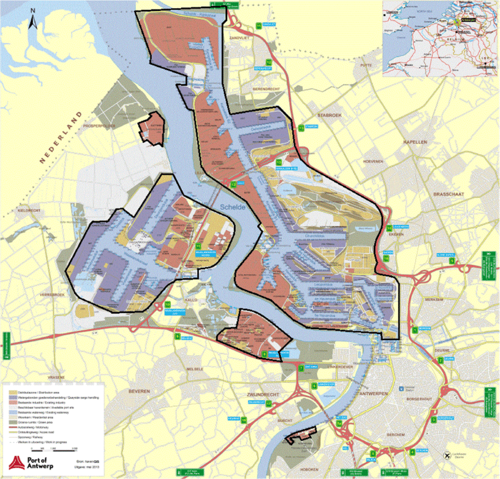

# Riding Shallow Waters 

<div>
 
</div>


## with Domenico Lahaye and Henk Schuttelaars 

## Section 1: Introduction 

This project aims at contributing to the computational modeling of [tidal flows](https://en.wikipedia.org/wiki/Tide#Current) and [sediment transport](https://en.wikipedia.org/wiki/Sediment_transport) in rivers. The flow of water in rivers can be described by the [shallow water equations](https://en.wikipedia.org/wiki/Shallow_water_equations) (linear vs. non-linear variant, laminar vs. turbulent model). When exicited periodically (e.g. by tidal motion at the inlet of the channel), the non-linear nature of the equations will deform (modulate) the amplitude and frequency of the driving system. After sufficiently long time, the signal will become periodic again. Both time-integration (after spatial discretization or method of lines) and harmonic balance methods (either after spatial or temporal discretization) will be explored. See the Section entitled Analysis in [wikipedia page on tidal flows](https://en.wikipedia.org/wiki/Tide#Current) for a motivation of harmonic balance method in the context of this project. 

The <b>goals</b> of the project include 
1. to solve the shallow water equations using a blend of analytical and numerical methods;   
2. to compute the amplitude and temporal frequency content of the computed axial and transversal velocity components and the water height;
3. to discover patterns in the sediment formation and study the stability of these patterns (via bifurcation analysis).

The <b>use of the Julia programming language</b> is an integral part of the learning objectives of this project. Non-linear terms play an essential role in modifying the temporal frequency content of waves as they propagate. The analysis of these non-linear terms requires the computation of the Jacobian, independent of whether a transient time-stepping or harmonic balance method is used. Functions to compute these Jacobians in Python do exist. These functions, however, are either computationally costly (in case that finite difference quotients are used) or non-trivial to use (in case that automatic differentiation in a library like e.g. [JAX](https://jax.readthedocs.io/en/latest/quickstart.html) is used). Switching to Julia alleviates these bottlenecks. 

## Section 2: Shallow Water Flow 

### Section 1.2: Shallow Water Equations 

The shallow water equations describe the propagation of water waves in rivers. Both linear and non-linear variants of the model. They are derived from the Navier-Stokes equations by averaging in the depth direction. 

The primary notebook for this level is [notebook on shallow water equations](./notes-shallow-water-equations.ipynb) (requires implementation of linear SWE (operators constant throught time integration) and non-linear SWE (operators updated at each time step)). 

### Section 2.2: Implementation in Julia 

Supporting notebooks for this level include
1. notebook on [scalar advection equation](./scalar_advection-equation.ipynb) (here we exclude diffusion. Wave propagation in one direction only);
1. notebook on [one-dimensional shallow water equations](./one-dim-shallow-water-equations.ipynb) (coupled system of two transport equations); 

## Section 3: Damped Non-Linear Wave Equation with Periodic Forcing

Throughout we project, we make the following four <b>important</b> assumptions: 

1. <b>periodic forcing</b>: the motion of water in the channel is caused by tital currents at the inlet of the channel. For simplicity, we assume a sinusoidal excitation at single frequency driving frequency $\omega_d$ appears. The single frequency assumption is merely a mild assumption, as more general periodic excitation can be decomposed into set of frequencies by a Fourier decomposition.
2. <b>damping</b>: the motion of water is described by a the wave equation that contains damping (typically friction of the water with the river bed). This damping causes initial transient in the solution to disappear in time. A steady-state solution that depends on the driving frequency $\omega_d$ appears; 
3. <b>non-linearity</b>: the wave equation contains non-linear transport and/or friction terms. This non-linearity causes the frequency of the driving force to be modulated. The solution contains more than one frequency, even if the driving frequency varries at a single frequency. Consider $\sin^3(x)$ as an example. We assume that the non-lineary is polynomial (in position, velocity or both). More general non-linearities can be accomodated via Taylor approximations;   
4. <b>parametric</b>: the wave equation contains parameters such as the amplitude of the forcing or the amplitude of the polynomial non-linear terms. We are intered in how the solution depends on these parameters.  

## Section 4: Bifurcation Analysis 

Study of points of equilibrium of the dynamical system (roots of coupled system of algebraic equations after linearizatio, eigenvalues and eigenvectors on the Jacobian) as function of parameter in the system. See e.g. tutorial examples of [BifurcationKitDocs.jl](https://bifurcationkit.github.io/BifurcationKitDocs.jl/dev/)

### Section 1.4: Implementation in Julia 

1. notebook on [solving the harmonic balance equations](./bifurcationkit.ipynb). In this notebook the harmonic balance equations are solved using bifurcation analysis tools. Both non-linear damping and non-linear stiffness are introduced;   

## Section 5: Harmonic Balance Method 

The harmonic balance method is explained in the notebook on [the harmonic balance method](./harmonic_balance_method.ipynb).

## Section 6: Project Levels 

The project is divided in various levels that are outlined below.

### Section 1.6: Beginner Level: Scalar Wave Equation with Cubic Damping for a String 

Here we only consider the channel to be long and narrow. This allows to describe the channel along the $x$-direction only. 

The <b>goals</b> of the beginners level of the assignments are to: 
1. solve the wave equation numerically by appling the method of lines. First discretize the equation in space. Subsequently solve the initial value problem for the resulting coupled system of ordinary differential equations using time-integration. For spatial discretization, a central finite difference scheme on a uniform mesh can be used. (List alternatives such as ApproxFun and Chmly here). For time integration, methods provided by [SciML.jl](https://docs.sciml.ai/Overview/stable/) can be used. Time-integration provides a reference solution. Investigate the computed solution in frequency domain using Fourier transformations. Repeat for various driving frequencies and investigate the occurance of resonant frequencies and corresponding resonant eigenmodes;
3. solve the wave equation using the harmonic balance method by solving the boundary value problem for the amplitiudes of the harmonic amplitiudes using a shooting method. Start by consering an expansion in a single harmoinic. In this case, the harmonic balance method harmonic balance method results in a coupled system of two Helmholtz equations for the amplitudes $A(x)$ and $B(x)$. Possibly extend later to two or more harmonics. Compare the solutions obtained by time-integration and the harmonic balance method for various frequencies;
4. repeat above for various values of the amplitude of the non-linear damping and investigate how the amplitide of the dominant resonant modes is affected (i.e., perform a bifurcation analysis);  

The primary notebook for this level is [non-linear 1D scalar wave equation](./nonlinear-wave-equation.ipynb).

Supporting notebooks for this level include:
1. information on seperation of variables, eigenvalues and eigenmodes [seperation-variables](scalar-wave-equation.ipynb). Of interst in discovering resonant modes in frequency response sweeps;

### Section 2.6: Intermediate Level: Scalar Wave Equation with Cubic Damping for a Rectangular Membrane 

Here we describe water waves as longitudinal ($x$-direction) and transversal ($y$-direction) wave propagation in a rectangular membrane excited by periodic forcing (tidal currents). The physics of the change of water height is neglected. 

The <b>goals</b> of the intermediate level is to extend previous results from one to two spatial dimensions. 
1. for the spatial discretization, uniform tensor product grids can be used;
2. for time-integration, [SciML.jl](https://docs.sciml.ai/Overview/stable/) can be used;
3. the harmonic balance method with a single expansion frequency results in a coupled system of two non-linear Helmholtz equations for the amplitudes $A(x,y)$ and $B(x,y)$. A suitabe solution method is to be identified;

###  Section 3.6: Expert Level:  Shallow Water Eqiuations with Cubic Damping for a Rectangular Channel 

The <b>goals</b> of the intermediate level is to extend previous results to the shallow water equations. 

###  Section 4.6: Expert+ Level: Pattern Formation in Sediment Transport in Rivers 

Add coupling of the shallow water equation with additional transport (convection-diffusion) equation for concentration of sediment in water. Describe two-way coupling between water flow and sediment transport. Water flow transports the sediment. The sediment add mass and viscosity to the water and slows down the water.    

Add bifurcation analysis to 

## Section 7: Introductory material on the Julia Programming Language

- Elementary introduction: [Thinking Julia](https://benlauwens.github.io/ThinkJulia.jl/latest/book.html);
- Aalto Short Course: [julia-introduction](https://github.com/AaltoRSE/julia-introduction); 
- Video Collection by Chris Rackauckas: [link](https://www.youtube.com/playlist?list=PLCAl7tjCwWyGjdzOOnlbGnVNZk0kB8VSa) 
- Pointer to lots of goodies: [Nouvelles Julia](https://pnavaro.github.io/NouvellesJulia/pages/2022_03.html);

## References 

1. Book by Boyce and di Prima on differential euations;
2. book by Evans on Partial Differential Equations; 
1. Book by Malte Krack and Johann Gross <i>Harmonic Balance for Non-Linear Vibration Problems</i>: [link](https://mega.nz/file/fYFWxQBT#OzIjwMd56nQDBzOeJ1VdSAWIO6i3dWuzUw4qnsFCQHs); 
2. Master thesis of Marco Roozendaal: [link](https://repository.tudelft.nl/islandora/object/uuid%3Aedc2ffd6-00fd-4cd6-883b-13b14528cb72?collection=education) 
3. PhD Thesis of Tjebbe Hepkema: Chapter 5 in particular: [link](https://mega.nz/file/nMF2DaDA#W-nuZ_LKQkcN8x-dZiXY4VD1gNRiTzf46RH0RQCEP9E). Includes linear stability analysis. 
4. PhD Thesis of Mirian Ter Brake: [link](https://repository.tudelft.nl/islandora/object/uuid:5cfcad13-0140-4ecc-a61b-217191b7611f?collection=research)
5. 2022 minor students report: [link](https://mega.nz/file/zMVySRYS#Pojfaiy0OrE1bncgTiRftYnuLzmDgiZM4t_xEneQSGQ)
6. 2022 minor students github repository: [link](https://github.com/victoriayuechen/Nonlinear-tidal-bars)
7. 2023 minor students report part A: [link](https://mega.nz/file/CMkn3KaK#F0VkA8qduoqYQhuUdhllTsHJSetERdP6oF2yeszb7gg)
8. 2023 minor students report part B: [link](https://mega.nz/file/LMUElTzK#phkzaRSQ2uu-eSgxM-pS2zGq7ASQ96GhOG1myYRJabg)
9. 2023 minor students report part B further elaborated: [link](https://mega.nz/file/bcVilJSb#l7eQk-9NWH-ICmZ3u886W8vn3Ds7jheNu6q4xqjSkZs)
10. Chapter 7 on forced oscillations of the book Nonlinear Ordinary Differential Equation by Jordan and Smith discusses forced oscillations: see [link](https://www.google.nl/books/edition/Nonlinear_Ordinary_Differential_Equation/ewtREAAAQBAJ?hl=en&gbpv=1&dq=Jordan+smith+nonlinear+ordinary+differential+equations&printsec=frontcover)
11. paper by Elliot e.a. Nonlinear damping and quasi-linear modeling provides reference solutions for the harmonic balence method;


```julia

```
